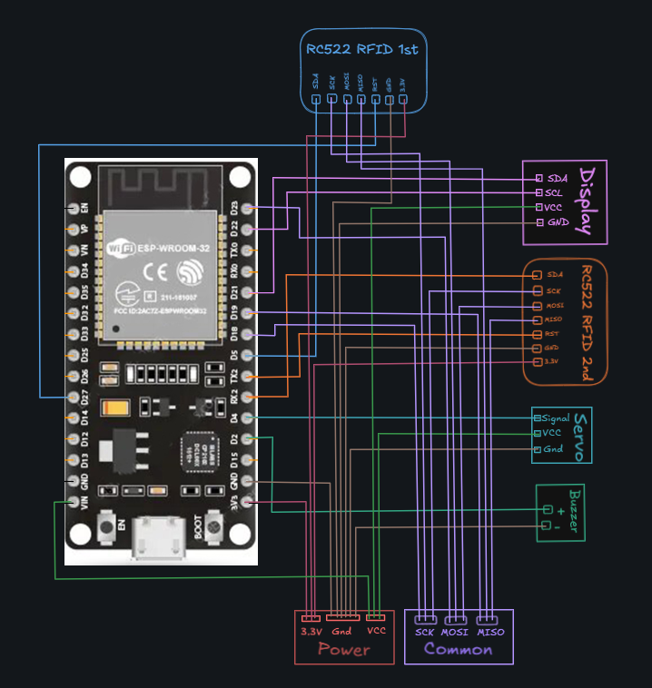
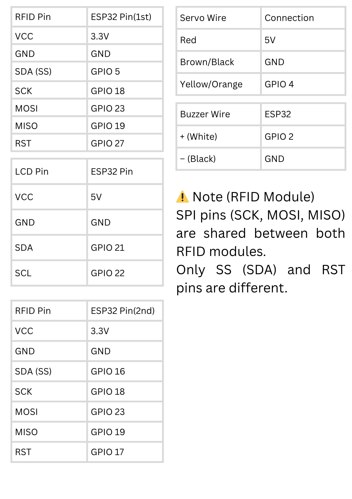
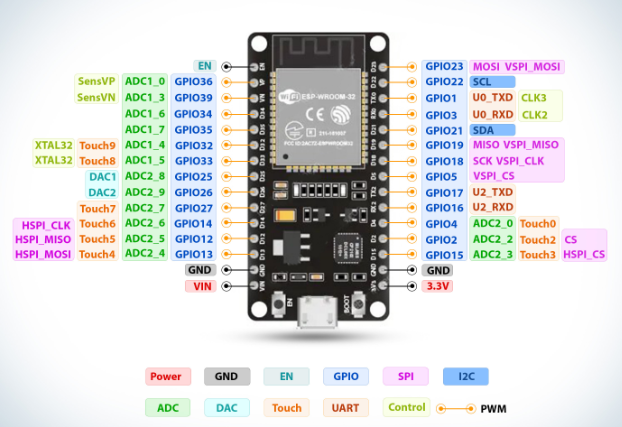
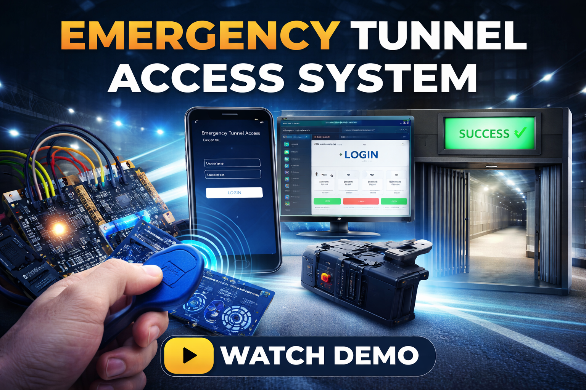

# 🚨 Emergency Tunnel Access Control System

A multi-factor authentication system combining IoT and full-stack web technologies for secure access control in high-security environments.

---

## 🔐 Key Features

* RFID-based authentication
* Secure login (ID & Password)
* OTP verification (TOTP)
* Servo-controlled gate access
* Admin UID verification system

---

## 🧠 Project Workflow

1. RFID card is scanned
2. ESP32 validates UID and displays IP
3. User logs in via web interface
4. OTP verification (Microsoft Authenticator)
5. On success → gate opens
6. On failure → buzzer alert + reset
7. Admin can verify using UID

---

## 💻 Tech Stack

### IoT

* ESP32
* RFID (MFRC522)
* Servo Motor
* LCD Display

### Backend

* Node.js
* Express.js
* MongoDB
* JWT Authentication

### Frontend

* React.js (Vite)
* Tailwind CSS

---

## ⚙️ Installation & Setup

### Backend

cd Web-App/backend
npm install
npm run dev

### Frontend

cd Web-App/frontend
npm install
npm run dev

### ESP32

* Upload code using Arduino IDE
* Connect hardware as per wiring diagram

---

## 👤 Authorized Personnel & Ranks

| Name             | Email                                                           | Role         |
| ---------------- | --------------------------------------------------------------- | ------------ |
| Tamanna Saini    | [tamannasaini860@gmail.com](mailto:tamannasaini860@gmail.com)   | Soldier      |
| Sonakshi Dhiman  | [sonakshidhiman12@gmail.com](mailto:sonakshidhiman12@gmail.com) | Soldier      |
| Admin            | [admin@gate.local](mailto:admin@gate.local)                     | Commander    |
| Security Officer | [security@gate.local](mailto:security@gate.local)               | Gate Control |

---

## 🔌 Hardware Setup

### 🔧 Wiring Diagram

### 📋 Pin Mapping Table

### 📍 ESP32 Pin Reference

### ⚠️ Notes
- SPI pins (SCK, MOSI, MISO) are shared between both RFID modules  
- Only SS (SDA) and RST pins are different  
- LCD uses I2C (GPIO 21, 22)  
- Servo uses PWM (GPIO 4)

---

## 🎥 Demo

---

## 🚀 Future Improvements

* Access logging system
* Cloud integration
* HTTPS security
* Role-based access

---

## ⚖️ License & Usage

This project is developed for educational purposes and demonstration of secure access control systems.
